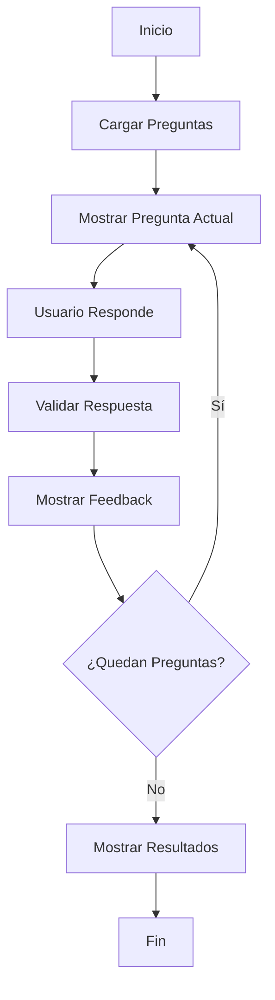

# 🧪 Quiz de Ciencias Físicas

Un sistema de preguntas y respuestas desarrollado en Kotlin para aprender conceptos fundamentales de física de manera interactiva. Perfecto para estudiantes principiantes que quieren practicar programación mientras refuerzan conocimientos científicos.

## 📋 Tabla de Contenidos

- [Descripción del Proyecto](#-descripción-del-proyecto)
- [Características](#-características)
- [Requisitos del Sistema](#-requisitos-del-sistema)
- [Instalación](#-instalación)
- [Uso](#-uso)
- [Estructura del Código](#-estructura-del-código)
- [Personalización](#-personalización)
- [Próximas Mejoras](#-próximas-mejoras)
- [Contribuir](#-contribuir)

## 🎯 Descripción del Proyecto

Este proyecto implementa un sistema de quiz interactivo que presenta preguntas aleatorias de ciencias físicas. Los usuarios pueden responder preguntas de diferentes categorías y dificultades, recibir feedback inmediato y obtener una puntuación final con análisis de rendimiento.

### Objetivos Educativos
- **Programación**: Aprender conceptos básicos de Kotlin (clases, listas, funciones)
- **Ciencias**: Repasar conceptos fundamentales de física
- **Lógica**: Desarrollar pensamiento algorítmico y estructurado

## ✨ Características

### 🎮 Funcionalidades del Quiz
- ✅ **Preguntas aleatorias** de física con 4 opciones múltiples
- ✅ **Categorías organizadas** (Mecánica, Óptica, Termodinámica, etc.)
- ✅ **Niveles de dificultad** (Fácil, Medio, Difícil)
- ✅ **Feedback inmediato** con explicaciones educativas
- ✅ **Sistema de puntuación** con porcentajes y evaluación final
- ✅ **Progreso visual** mostrando pregunta actual vs total
- ✅ **Orden aleatorio** en cada ejecución

### 🔧 Características Técnicas
- 📱 **Aplicación de consola** fácil de ejecutar
- 🏗️ **Código modular** con separación de responsabilidades
- 📊 **Estructuras de datos** bien organizadas
- 🔄 **Reutilizable** y fácil de expandir
- 📚 **Comentarios explicativos** para principiantes

## 💻 Requisitos del Sistema

### Software Necesario
- **Java JDK 8 o superior** (recomendado JDK 11+)
- **Kotlin 1.8+** o IntelliJ IDEA con plugin de Kotlin
- **IDE recomendado**: IntelliJ IDEA Community (gratuito)

### Alternativas de Ejecución
1. **IntelliJ IDEA** (más fácil para principiantes)
2. **Android Studio** (si se planea expandir a móvil)
3. **VS Code** con extensión de Kotlin
4. **Línea de comandos** con kotlinc

## 🚀 Instalación

### Opción 1: IntelliJ IDEA (Recomendada)

1. **Descargar IntelliJ IDEA**
   ```
   https://www.jetbrains.com/idea/download/
   ```

2. **Crear nuevo proyecto**
   - Abrir IntelliJ IDEA
   - File → New → Project
   - Seleccionar "Kotlin" → "Console Application"
   - Configurar:
     - Project name: `quiz-ciencias`
     - Location: ruta deseada
     - Language: Kotlin
     - Build system: IntelliJ

3. **Copiar el código**
   - Reemplazar el contenido de `Main.kt` con el código del quiz
   - O crear archivo nuevo: `QuizCiencias.kt`

4. **Ejecutar**
   - Click derecho en el archivo → Run 'MainKt'
   - O usar el botón de play verde

### Opción 2: Línea de Comandos

1. **Instalar Kotlin**
   ```bash
   # En macOS con Homebrew
   brew install kotlin
   
   # En Ubuntu/Debian
   sudo apt install kotlin
   
   # En Windows, descargar desde:
   # https://kotlinlang.org/docs/command-line.html
   ```

2. **Crear directorio del proyecto**
   ```bash
   mkdir quiz-ciencias
   cd quiz-ciencias
   ```

3. **Crear archivo del quiz**
   ```bash
   # Crear archivo QuizCiencias.kt y pegar el código
   nano QuizCiencias.kt
   ```

4. **Compilar y ejecutar**
   ```bash
   # Compilar
   kotlinc QuizCiencias.kt -include-runtime -d quiz-ciencias.jar
   
   # Ejecutar
   java -jar quiz-ciencias.jar
   ```

### Opción 3: Proyecto Gradle (Avanzado)

1. **Crear estructura de proyecto**
   ```bash
   mkdir quiz-ciencias
   cd quiz-ciencias
   gradle init --type kotlin-application
   ```

2. **Modificar build.gradle.kts**
   ```kotlin
   plugins {
       kotlin("jvm") version "1.8.20"
       application
   }
   
   repositories {
       mavenCentral()
   }
   
   dependencies {
       implementation("org.jetbrains.kotlin:kotlin-stdlib")
   }
   
   application {
       mainClass.set("MainKt")
   }
   ```

## 🎮 Uso

### Ejecución Básica

1. **Iniciar el programa**
   ```
   === QUIZ DE CIENCIAS FÍSICAS ===
   Responde las siguientes preguntas seleccionando el número de la opción correcta.
   ```

2. **Responder preguntas**
   ```
   Pregunta 1/5
   Categoría: Mecánica | Dificultad: Fácil
   
   ¿Cuál es la unidad de medida de la fuerza en el Sistema Internacional?
   1. Newton
   2. Joule
   3. Watt
   4. Pascal
   
   Tu respuesta (1-4): 1
   ```

3. **Ver feedback**
   ```
   ✅ ¡Correcto!
   💡 El Newton (N) es la unidad de fuerza, definida como kg⋅m/s²
   ```

4. **Resultados finales**
   ```
   🎉 QUIZ COMPLETADO 🎉
   Preguntas respondidas: 5
   Respuestas correctas: 4
   Puntuación: 80.0%
   👍 ¡Muy bien! Tiene buenos conocimientos
   ```

### Comandos Durante la Ejecución
- **Números 1-4**: Seleccionar respuesta
- **Enter**: Confirmar respuesta
- El programa termina automáticamente al completar todas las preguntas

## 🏗️ Estructura del Código

### Clases Principales

#### `Pregunta` (Data Class)
```kotlin
data class Pregunta(
    val id: Int,                    // Identificador único
    val pregunta: String,           // Texto de la pregunta
    val opciones: List<String>,     // Lista de 4 opciones
    val respuestaCorrecta: Int,     // Índice de respuesta correcta (0-3)
    val categoria: String,          // Categoría (ej: "Mecánica")
    val dificultad: String,         // Nivel (ej: "Fácil")
    val explicacion: String?        // Explicación opcional
)
```

#### `Resultado` (Data Class)
```kotlin
data class Resultado(
    val preguntasRespondidas: Int,  // Total de preguntas respondidas
    val respuestasCorrectas: Int,   // Número de aciertos
    val puntuacion: Double          // Puntuación calculada
)
```

#### `QuizCiencias` (Clase Principal)
- **Propiedades**: Lista de preguntas, estado actual, contador de aciertos
- **Métodos principales**:
  - `cargarPreguntasEjemplo()`: Inicializa preguntas predefinidas
  - `obtenerPreguntaActual()`: Retorna pregunta actual
  - `responder(Int)`: Procesa respuesta del usuario
  - `obtenerResultado()`: Calcula y retorna resultados finales
  - `reiniciarQuiz()`: Reinicia el estado para nueva partida

### Flujo del Programa



## 🎨 Personalización

### Agregar Nuevas Preguntas

```kotlin
// En el método cargarPreguntasEjemplo()
preguntas.add(
    Pregunta(
        id = 6,
        pregunta = "¿Tu nueva pregunta aquí?",
        opciones = listOf("Opción A", "Opción B", "Opción C", "Opción D"),
        respuestaCorrecta = 0, // Índice de la respuesta correcta (0-3)
        categoria = "Tu Categoría",
        dificultad = "Fácil", // Fácil, Medio, Difícil
        explicacion = "Explicación de la respuesta correcta"
    )
)
```

### Modificar Sistema de Puntuación

```kotlin
// En calcularPuntuacion()
private fun calcularPuntuacion(): Double {
    // Puntuación personalizada
    val base = (respuestasCorrectas.toDouble() / preguntaActual) * 100
    // Agregar bonificación por dificultad, tiempo, etc.
    return base
}
```

### Agregar Nuevas Categorías

```kotlin
// Crear enum para categorías
enum class Categoria {
    MECANICA, OPTICA, TERMODINAMICA, 
    ELECTRICIDAD, MAGNETISMO, FISICA_MODERNA
}
```

## 🔄 Próximas Mejoras

### Versión 2.0 - Funcionalidades Intermedias
- [ ] **Base de datos SQLite** para almacenar preguntas
- [ ] **Interfaz gráfica** con JavaFX o Android
- [ ] **Sistema de usuarios** con registro de progreso
- [ ] **Modo cronometrado** con límite de tiempo
- [ ] **Ranking** de mejores puntuaciones
- [ ] **Importar preguntas** desde CSV/JSON

### Versión 3.0 - Características Avanzadas
- [ ] **Multiplayer** local o en red
- [ ] **Generador automático** de preguntas usando IA
- [ ] **Estadísticas detalladas** por categoría
- [ ] **Sistema de logros** y badges
- [ ] **Modo estudio** con repaso de errores
- [ ] **API REST** para sincronización en la nube

### Expansión a Otras Materias
- [ ] **Quiz de Química** con tabla periódica
- [ ] **Quiz de Matemáticas** con diferentes niveles
- [ ] **Quiz de Biología** con imágenes
- [ ] **Quiz multidisciplinario** combinado

## 🤝 Contribuir

### Cómo Contribuir
1. **Fork** el repositorio
2. **Crear rama** para tu feature (`git checkout -b feature/nueva-caracteristica`)
3. **Commit** tus cambios (`git commit -am 'Agregar nueva característica'`)
4. **Push** a la rama (`git push origin feature/nueva-caracteristica`)
5. **Crear Pull Request**

### Tipos de Contribuciones Bienvenidas
- 📝 **Nuevas preguntas** de ciencias (con fuentes confiables)
- 🐛 **Corrección de bugs** y errores
- ✨ **Nuevas funcionalidades** (interfaz gráfica, base de datos)
- 📚 **Mejoras en documentación** y ejemplos
- 🎨 **Mejoras en UX/UI** para versiones gráficas
- 🧪 **Tests unitarios** y validaciones

### Estándares de Código
- **Kotlin coding conventions**: Seguir estándares oficiales
- **Comentarios explicativos**: Especialmente para principiantes
- **Nombres descriptivos**: Variables y funciones claras
- **Modularidad**: Separar responsabilidades en clases/funciones

---

## 📞 Contacto y Soporte

¿Tiene preguntas o sugerencias? 
- 📧 Crear un **Issue** en GitHub
- 💬 Contribuir con **Pull Requests**
- 📖 Revisar la **documentación** en el código

---

**¡Diviertase aprendiendo programación y física al mismo tiempo! 🚀🧪**