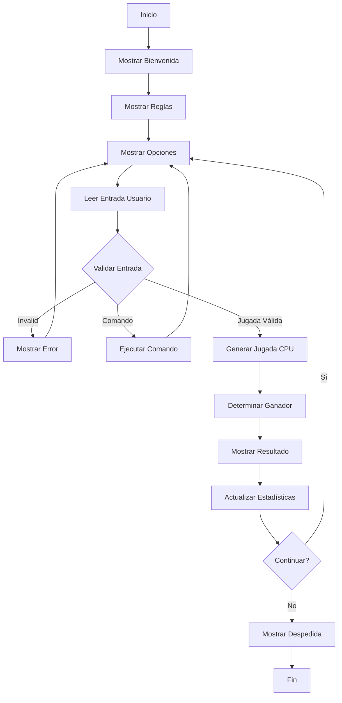

#  Piedra, Papel, Tijeras, Lagarto, Spock

Un juego de consola desarrollado en Kotlin basado en la versión expandida del clásico "Piedra, Papel, Tijeras" popularizada por el personaje Sheldon Cooper en la serie de televisión "The Big Bang Theory". Este proyecto está diseñado para estudiantes de programación de nivel principiante que desean practicar conceptos fundamentales mientras se divierten con un juego icónico de la cultura pop.

##  Tabla de Contenidos

- [Origen del Juego](#-origen-del-juego)
- [Descripción del Proyecto](#-descripción-del-proyecto)
- [Características](#-características)
- [Reglas del Juego](#-reglas-del-juego)
- [Requisitos del Sistema](#-requisitos-del-sistema)
- [Instalación](#-instalación)
- [Uso](#-uso)
- [Estructura del Código](#-estructura-del-código)
- [Conceptos de Programación](#-conceptos-de-programación)
- [Personalización](#-personalización)
- [Extensiones Futuras](#-extensiones-futuras)
- [Contribuir](#-contribuir)

##  Origen del Juego

### La Cita Original de Sheldon Cooper

En el episodio "The Lizard-Spock Expansion" de The Big Bang Theory, Sheldon Cooper introduce esta versión expandida del juego clásico con la siguiente explicación:

> *"It's very simple. Scissors cuts paper, paper covers rock, rock crushes lizard, lizard poisons Spock, Spock smashes scissors, scissors decapitates lizard, lizard eats paper, paper disproves Spock, Spock vaporizes rock, and as it always has, rock crushes scissors."*

### ¿Por qué esta versión?

Sheldon argumenta que la versión tradicional de tres elementos es demasiado limitada y propensa a empates. Al agregar **Lagarto** y **Spock**, se reduce significativamente la probabilidad de empates del 33.3% al 20%, creando un juego más dinámico y estratégico.

### Popularidad Cultural

Después de su aparición en la serie, este juego se volvió viral en internet y se convirtió en una referencia cultural popular, siendo adoptado por comunidades de programadores, científicos y fanáticos de la cultura geek en general.

##  Descripción del Proyecto

Este proyecto implementa una versión completa del juego de Sheldon Cooper como aplicación de consola interactiva. Los usuarios pueden jugar partidas ilimitadas contra la computadora, visualizar estadísticas detalladas y acceder a comandos especiales para mejorar la experiencia de juego.

### Objetivos Educativos

El proyecto está diseñado para enseñar conceptos fundamentales de programación a través de un contexto divertido y familiar:

- **Estructuras de datos**: Uso de enums, data classes y listas
- **Lógica condicional**: Implementación de reglas complejas de juego
- **Programación orientada a objetos**: Encapsulación y responsabilidades
- **Manejo de entrada/salida**: Interacción con el usuario
- **Gestión de estado**: Seguimiento de estadísticas y progreso

##  Características

###  Funcionalidades del Juego
-  **Cinco jugadas** disponibles: Piedra, Papel, Tijeras, Lagarto, Spock
-  **Reglas auténticas** basadas en la explicación de Sheldon Cooper
-  **Interfaz visual** con emojis representativos para cada jugada
-  **Oponente inteligente** con selección aleatoria equiprobable
-  **Explicaciones automáticas** de cada resultado con la regla aplicada
-  **Sistema de puntuación** en tiempo real
-  **Partidas ilimitadas** hasta que el usuario decida terminar

###  Sistema de Estadísticas
-  **Contador de partidas** jugadas totales
-  **Registro de victorias** del jugador y la computadora
-  **Contabilización de empates** 
-  **Cálculo automático** de porcentaje de victorias
-  **Visualización clara** de estadísticas acumuladas

###  Comandos Especiales
-  **'reglas'** - Muestra todas las reglas del juego con la cita de Sheldon
-  **'stats'** - Despliega estadísticas detalladas de la sesión actual
-  **'salir'** - Termina el juego y muestra resumen final
-  **Validación robusta** de entrada con mensajes de error descriptivos

##  Reglas del Juego

### Las 10 Reglas Fundamentales

Como estableció Sheldon Cooper, cada jugada puede vencer exactamente a dos oponentes y ser vencida por dos oponentes:

####  Piedra
1. **Piedra aplasta lagarto**
2. **Piedra aplasta tijeras**

####  Papel  
3. **Papel cubre piedra**
4. **Papel desaprueba a Spock**

####  Tijeras
5. **Tijeras cortan papel**
6. **Tijeras decapitan lagarto**

####  Lagarto
7. **Lagarto envenena a Spock**
8. **Lagarto se come papel**

####  Spock
9. **Spock aplasta tijeras**
10. **Spock vaporiza piedra**

### Matriz de Resultados

| Jugada vs | Piedra | Papel | Tijeras | Lagarto | Spock |
|-----------|--------|-------|---------|---------|-------|
| **Piedra** | Empate | Pierde | Gana | Gana | Pierde |
| **Papel** | Gana | Empate | Pierde | Pierde | Gana |
| **Tijeras** | Pierde | Gana | Empate | Gana | Pierde |
| **Lagarto** | Pierde | Gana | Pierde | Empate | Gana |
| **Spock** | Gana | Pierde | Gana | Pierde | Empate |

##  Requisitos del Sistema

### Software Necesario
- **Java JDK 8 o superior** (se recomienda JDK 11 o 17)
- **Kotlin 1.8+** o un IDE con soporte para Kotlin
- **Sistema operativo**: Windows, macOS, o Linux

### IDEs Recomendados
1. **IntelliJ IDEA Community** (gratuito, más amigable)
2. **Android Studio** (si se planea expandir a móvil)
3. **Visual Studio Code** con extensión de Kotlin
4. **Eclipse** con plugin de Kotlin

##  Instalación

### Método 1: IntelliJ IDEA (Recomendado para Principiantes)

1. **Descargar e instalar IntelliJ IDEA Community**
   ```
   https://www.jetbrains.com/idea/download/
   ```

2. **Crear nuevo proyecto Kotlin**
   - Abrir IntelliJ IDEA
   - Seleccionar `File` → `New` → `Project`
   - Elegir "Kotlin" → "Console Application"
   - Configurar nombre del proyecto: `sheldon-rock-paper-scissors`
   - Seleccionar JDK apropiado (11 o 17)

3. **Integrar el código**
   - Reemplazar el contenido de `Main.kt` con el código del juego
   - O crear un nuevo archivo: `SheldonGame.kt`

4. **Ejecutar el programa**
   - Click derecho en el archivo → `Run 'MainKt'`
   - O utilizar el botón de reproducción verde en la barra de herramientas

### Método 2: Línea de Comandos

1. **Verificar instalación de Kotlin**
   ```bash
   kotlinc -version
   java -version
   ```

2. **Crear directorio del proyecto**
   ```bash
   mkdir sheldon-game
   cd sheldon-game
   ```

3. **Crear y editar archivo del juego**
   ```bash
   touch SheldonGame.kt
   # Copiar el código en el archivo usando el editor preferido
   ```

4. **Compilar y ejecutar**
   ```bash
   # Compilar
   kotlinc SheldonGame.kt -include-runtime -d sheldon-game.jar
   
   # Ejecutar
   java -jar sheldon-game.jar
   ```

### Método 3: Proyecto Gradle (Avanzado)

1. **Inicializar proyecto Gradle**
   ```bash
   mkdir sheldon-game
   cd sheldon-game
   gradle init --type kotlin-application
   ```

2. **Configurar build.gradle.kts**
   ```kotlin
   plugins {
       kotlin("jvm") version "1.8.20"
       application
   }
   
   repositories {
       mavenCentral()
   }
   
   dependencies {
       implementation("org.jetbrains.kotlin:kotlin-stdlib")
   }
   
   application {
       mainClass.set("SheldonGameKt")
   }
   ```

3. **Ejecutar con Gradle**
   ```bash
   ./gradlew run
   ```

##  Uso

### Flujo de Juego Típico

1. **Inicio del programa**
   ```
    ¡Bienvenido al Juego de Big Bang Theory!
    Piedra, Papel, Tijeras, Lagarto, Spock
    "Como dijo Sheldon Cooper..."
   ```

2. **Visualización de reglas automática**
   - Se muestran todas las reglas con la cita completa de Sheldon
   - Explicación detallada de cada combinación ganadora

3. **Selección de jugada**
   ```
   Elige tu jugada:
   1.  Piedra
   2.  Papel
   3.  Tijeras
   4.  Lagarto
   5.  Spock
   
   Tu elección (1-5): 
   ```

4. **Resultado de la partida**
   ```
   ========================================
   Tu jugada:  Spock
   Computadora:  Tijeras
   ========================================
    ¡GANASTE!
    Spock aplasta tijeras
   
    Puntuación: Tú 1 - 0 Computadora
   ```

### Comandos Especiales Durante el Juego

- **'reglas'** - Volver a mostrar todas las reglas del juego
- **'stats'** - Ver estadísticas detalladas de la sesión actual
- **'salir'**, **'exit'**, **'q'** - Terminar el juego

### Estadísticas Finales

Al terminar el juego, se presenta un resumen completo:
```
🎭 === JUEGO TERMINADO ===

📊 === ESTADÍSTICAS ===
Partidas jugadas: 10
Tus victorias: 6
Victorias de la computadora: 3
Empates: 1
Porcentaje de victorias: 60.0%
========================

 ¡Felicitaciones! Eres el campeón.
 Como diría Sheldon: "Fascinating! Your pattern recognition is superior."

 "Bazinga! Gracias por jugar el juego favorito de Sheldon Cooper."
 Live long and prosper!
```

##  Estructura del Código

### Componentes Principales

#### Enum `Jugada`
```kotlin
enum class Jugada(val emoji: String, val descripcion: String) {
    PIEDRA("", "Piedra"),
    PAPEL("", "Papel"), 
    TIJERAS("", "Tijeras"),
    LAGARTO("", "Lagarto"),
    SPOCK("", "Spock")
}
```
Define las cinco jugadas posibles con representación visual y textual.

#### Data Class `Regla`
```kotlin
data class Regla(
    val ganador: Jugada,
    val perdedor: Jugada,
    val accion: String
)
```
Representa una regla específica del juego (ej: "Piedra aplasta tijeras").

#### Data Class `Estadisticas`
```kotlin
data class Estadisticas(
    var partidasJugadas: Int = 0,
    var victoriasJugador: Int = 0,
    var victoriasComputadora: Int = 0,
    var empates: Int = 0
)
```
Mantiene el registro de todas las estadísticas de la sesión de juego.

#### Enum `Resultado`
```kotlin
enum class Resultado {
    JUGADOR_GANA,
    COMPUTADORA_GANA,
    EMPATE
}
```
Representa los posibles resultados de cada partida.

#### Clase Principal `JuegoPiedraPapelTijerasLagartoSpock`

**Propiedades:**
- `reglas: List<Regla>` - Lista inmutable con las 10 reglas del juego
- `estadisticas: Estadisticas` - Objeto que mantiene el estado de la sesión

**Métodos principales:**
- `mostrarReglas()` - Presenta las reglas con formato y cita de Sheldon
- `obtenerJugadaComputadora()` - Genera selección aleatoria equiprobable
- `determinarGanador()` - Aplica lógica de reglas para determinar el resultado
- `obtenerExplicacion()` - Proporciona la explicación textual del resultado
- `jugarRonda()` - Maneja una ronda completa de juego con validaciones
- `mostrarMensajeDespedida()` - Presenta estadísticas finales y mensaje temático

### Flujo de Control



##  Conceptos de Programación

### Para Estudiantes Principiantes

#### Enumeraciones (Enums)
El proyecto demuestra el uso de enums para representar conjuntos fijos de valores relacionados, tanto para las jugadas como para los resultados.

#### Data Classes
Se utilizan data classes para estructurar datos relacionados (`Regla`, `Estadisticas`) con funcionalidades automáticas como `toString()`, `equals()`, y `copy()`.

#### Listas e Iteración
La gestión de reglas mediante listas inmutables y el uso de `find()`, `any()` y `forEach()` para búsquedas y procesamiento.

#### Programación Funcional
Uso de expresiones lambda, funciones de orden superior y operaciones de colecciones como `find{}` y `any{}`.

#### Manejo de Estado
La clase `Estadísticas` demuestra cómo mantener y actualizar el estado de la aplicación de manera controlada.

#### Validación de Entrada
Implementación robusta de validación con múltiples tipos de entrada (números, comandos, texto) y manejo de errores.

### Para Estudiantes Intermedios

#### Arquitectura Orientada a Objetos
Separación clara de responsabilidades entre clases, encapsulación de datos y métodos.

#### Patrones de Diseño
- **Strategy Pattern**: Diferentes tipos de comandos manejados polimórficamente
- **State Pattern**: Gestión del estado del juego através de la sesión

#### Generación de Números Aleatorios
Uso de `kotlin.random.Random` para crear un oponente impredecible pero justo.

##  Personalización

### Agregar Nuevas Jugadas

Para expandir el juego con jugadas adicionales:

1. **Modificar el enum `Jugada`**
   ```kotlin
   enum class Jugada(val emoji: String, val descripcion: String) {
       // Jugadas existentes...
       FUEGO(" ", "Fuego"),
       AGUA(" ", "Agua")
   }
   ```

2. **Agregar nuevas reglas**
   ```kotlin
   // En la lista de reglas
   Regla(Jugada.FUEGO, Jugada.PAPEL, "Fuego quema papel"),
   Regla(Jugada.AGUA, Jugada.FUEGO, "Agua apaga fuego"),
   ```

3. **Mantener equilibrio**
   Cada nueva jugada debe ganar contra exactamente 2 jugadas y perder contra 2 jugadas para mantener el equilibrio del juego.

### Personalizar Mensajes

```kotlin
// Modificar mensajes temáticos
fun mostrarMensajeDespedida() {
    when {
        // Personalizar mensajes de victoria/derrota
        estadisticas.victoriasJugador > estadisticas.victoriasComputadora -> {
            println(" Tu mensaje personalizado de victoria")
        }
    }
}
```

### Agregar Dificultades

```kotlin
enum class Dificultad {
    FACIL,    // CPU completamente aleatoria
    MEDIO,    // CPU evita repetir la misma jugada
    DIFICIL   // CPU intenta predecir patrones del jugador
}
```

### Sistema de Logros

```kotlin
data class Logro(
    val id: String,
    val nombre: String,
    val descripcion: String,
    val condicion: (Estadisticas) -> Boolean
)

val logros = listOf(
    Logro("primera_victoria", "Primera Sangre", 
          "Gana tu primera partida", 
          { it.victoriasJugador >= 1 }),
    Logro("sheldon_master", "Maestro Sheldon", 
          "Gana 10 partidas seguidas", 
          { /* lógica personalizada */ })
)
```

##  Extensiones Futuras

### Versión 2.0 - Mejoras de Interfaz
- [ ] **Interfaz gráfica** con JavaFX o Android
- [ ] **Animaciones** de jugadas con sprites
- [ ] **Sonidos temáticos** de The Big Bang Theory
- [ ] **Temas visuales** personalizables
- [ ] **Historia de partidas** persistente

### Versión 3.0 - Funcionalidades Avanzadas
- [ ] **Modo multijugador** local y en red
- [ ] **Torneo** con eliminación directa
- [ ] **IA adaptativa** que aprende patrones del jugador
- [ ] **Sistema de ranking** online
- [ ] **Replay** de partidas memorables

### Versión 4.0 - Expansión del Universo
- [ ] **Variantes del juego** (modo rápido, modo supervivencia)
- [ ] **Personajes jugables** (Sheldon, Leonard, Penny, etc.)
- [ ] **Frases auténticas** de cada personaje
- [ ] **Estadísticas globales** sincronizadas
- [ ] **Integración con redes sociales**

### Expansiones Técnicas
- [ ] **API REST** para backend de estadísticas
- [ ] **Base de datos** para persistencia de usuarios
- [ ] **Testing automatizado** con JUnit
- [ ] **CI/CD pipeline** con GitHub Actions
- [ ] **Documentación API** con Swagger

##  Contribuir

### Tipos de Contribuciones Bienvenidas

#### Para Principiantes
-  **Corrección de bugs** menores y typos
-  **Mejoras visuales** (emojis, formato, colores)
-  **Documentación** adicional y ejemplos
-  **Traducciones** a otros idiomas
-  **Ideas y sugerencias** para nuevas funcionalidades

#### Para Desarrolladores Intermedios
-  **Refactoring** de código para mejor legibilidad
-  **Optimizaciones** de rendimiento
-  **Tests unitarios** y de integración
-  **Versión Android** del juego
-  **Versión web** con Kotlin/JS

#### Para Desarrolladores Avanzados
-  **IA avanzada** para oponente inteligente
-  **Backend** con microservicios
-  **Analytics** y métricas de juego
-  **Sistema de competencias** online
-  **Game engine** personalizado

### Proceso de Contribución

1. **Fork** el repositorio
2. **Crear rama** temática (`git checkout -b feature/nueva-funcionalidad`)
3. **Implementar** cambios siguiendo estándares de código
4. **Agregar tests** para nueva funcionalidad (si aplica)
5. **Actualizar documentación** relevante
6. **Commit** con mensajes descriptivos
7. **Push** a la rama (`git push origin feature/nueva-funcionalidad`)
8. **Crear Pull Request** con descripción detallada

### Estándares de Código

- **Kotlin Coding Conventions**: Seguir estándares oficiales de JetBrains
- **Documentación**: Comentarios KDoc para funciones públicas
- **Nomenclatura**: Nombres descriptivos en español para conceptos de dominio
- **Modularidad**: Separación clara de responsabilidades
- **Testing**: Cobertura mínima del 80% para nueva funcionalidad

---

##  Referencias

- **Serie Original**: The Big Bang Theory, Temporada 2, Episodio 8: "The Lizard-Spock Expansion"
- **Creador del Juego**: Sam Kass (Internet pioneer)
- **Popularizado por**: Sheldon Cooper (personaje de Jim Parsons)
- **Kotlin Documentation**: [kotlinlang.org](https://kotlinlang.org/docs/)
- **The Big Bang Theory Wiki**: [bigbangtheory.fandom.com](https://bigbangtheory.fandom.com/)

---

**¡Bazinga! Que la diversión y el aprendizaje estén contigo! **
