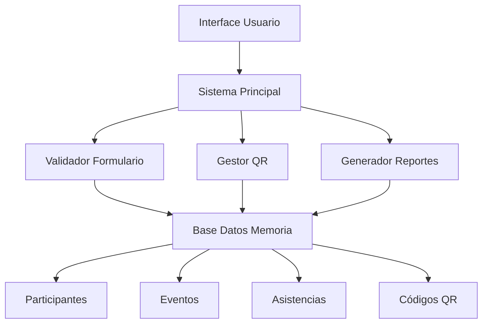
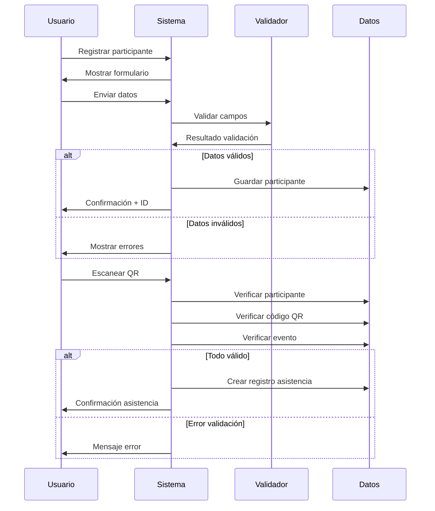

# 🎓 Sistema de Asistencia a Eventos Académicos con QR

Un sistema completo de registro y control de asistencia para eventos académicos desarrollado en Kotlin. La aplicación permite el registro de participantes mediante formularios validados y el control de asistencia a través de códigos QR, diseñado específicamente para instituciones educativas, conferencias, seminarios y eventos académicos.

## 📋 Tabla de Contenidos

- [Descripción del Proyecto](#-descripción-del-proyecto)
- [Características Principales](#-características-principales)
- [Casos de Uso](#-casos-de-uso)
- [Arquitectura del Sistema](#-arquitectura-del-sistema)
- [Requisitos del Sistema](#-requisitos-del-sistema)
- [Instalación](#-instalación)
- [Guía de Uso](#-guía-de-uso)
- [Estructura del Código](#-estructura-del-código)
- [Validaciones de Formulario](#-validaciones-de-formulario)
- [Sistema de Códigos QR](#-sistema-de-códigos-qr)
- [Reportes y Estadísticas](#-reportes-y-estadísticas)
- [Personalización](#-personalización)
- [Expansiones Futuras](#-expansiones-futuras)
- [Contribuir](#-contribuir)

## 🎯 Descripción del Proyecto

Este sistema digitaliza el proceso tradicional de registro de asistencia en eventos académicos, eliminando las listas de papel y proporcionando un control automatizado, seguro y eficiente. Los participantes se registran una sola vez y pueden acceder a múltiples eventos usando códigos QR únicos.

### Problemática que Resuelve

**Métodos tradicionales:**
- ❌ Listas de papel propensas a pérdidas
- ❌ Proceso lento de verificación manual
- ❌ Errores de transcripción de nombres
- ❌ Dificultad para generar reportes
- ❌ Imposibilidad de control en tiempo real

**Solución digital:**
- ✅ Registro digital permanente e inmutable
- ✅ Verificación instantánea mediante QR
- ✅ Validación automática de datos
- ✅ Reportes automáticos y estadísticas
- ✅ Monitoreo en tiempo real de asistencia

### Público Objetivo

- **Universidades** - Control de asistencia a clases y eventos
- **Organizadores de conferencias** - Gestión profesional de eventos
- **Instituciones educativas** - Seminarios y talleres
- **Empresas** - Capacitaciones y eventos corporativos
- **Estudiantes de programación** - Proyecto de aprendizaje práctico

## ✨ Características Principales

### 📝 Sistema de Registro Completo
- **Formulario validado** con campos obligatorios y opcionales
- **Validación en tiempo real** de email, teléfono y contraseñas
- **Clasificación de participantes** (estudiante, profesor, investigador, etc.)
- **Registro de instituciones** de procedencia
- **Generación automática** de IDs únicos
- **Confirmación inmediata** con todos los datos

### 🔒 Validaciones de Seguridad
- **Emails** - Validación con expresiones regulares RFC compliant
- **Teléfonos** - Formato internacional con limpieza automática
- **Contraseñas seguras** - Mínimo 8 caracteres, mayúsculas, minúsculas y números
- **Nombres** - Solo caracteres alfabéticos y acentos permitidos
- **Prevención de duplicados** - Control de registros múltiples

### 📱 Sistema de Códigos QR
- **Generación automática** de códigos únicos por evento
- **Simulador integrado** de escaneo para testing
- **Validación cruzada** de participante, evento y código
- **Prevención de doble registro** de asistencia
- **Registro de metadata** (timestamp, IP, dispositivo)
- **Códigos reutilizables** con contador de usos

### 🎓 Gestión de Eventos Académicos
- **Tipos de eventos** - Conferencia, seminario, taller, congreso, webinar
- **Control de capacidad** máxima y disponibilidad
- **Programación temporal** con fechas de inicio y fin
- **Información detallada** del evento y organizadores
- **Códigos de acceso** únicos por evento
- **Gestión de múltiples eventos** simultáneos

### 📊 Sistema de Reportes y Analytics
- **Estadísticas en tiempo real** por evento
- **Porcentajes de ocupación** y asistencia efectiva
- **Desglose demográfico** por tipo de participante
- **Lista detallada** de todos los asistentes
- **Exportación de datos** en formato tabular
- **Reportes históricos** con timestamps precisos

## 🏫 Casos de Uso

### Instituciones Educativas

#### Universidad Nacional - Conferencia de IA
```
Evento: "Conferencia Internacional de IA 2024"
Capacidad: 200 personas
Participantes registrados: 180
Asistencia real: 165 (92% de los registrados)
Desglose: 
- Estudiantes: 89 (54%)
- Profesores: 45 (27%)
- Investigadores: 31 (19%)
```

#### Proceso Típico:
1. **Pre-evento**: Participantes se registran online
2. **Día del evento**: QR codes distribuidos en entrada
3. **Check-in**: Escaneo automático al ingresar al auditorio
4. **Monitoreo**: Seguimiento en tiempo real de asistencia
5. **Post-evento**: Reportes automáticos para certificación

### Eventos Corporativos

#### Empresa Tech - Capacitación Interna
```
Evento: "Workshop Desarrollo Ágil"
Modalidad: Obligatoria para developers
Control: QR individual por empleado
Resultado: 100% trazabilidad para RRHH
```

### Investigación Académica

#### Centro de Investigación - Simposio
```
Evento: "Simposio de Biotecnología"
Participantes: Investigadores internacionales
Requerimiento: Registro preciso para networking
Beneficio: Base de datos de contactos automática
```

## 🏗️ Arquitectura del Sistema

### Patrón de Diseño: MVC Simplificado



### Componentes del Sistema

#### Capa de Datos (Data Layer)
```kotlin
// Modelos de datos principales
- Participante: Información personal y académica
- EventoAcademico: Detalles del evento y configuración
- RegistroAsistencia: Log de asistencia con metadata
- CodigoQR: Gestión de códigos de acceso
```

#### Capa de Lógica (Business Layer)  
```kotlin
// Procesamiento y validaciones
- SistemaAsistenciaEventos: Orquestador principal
- ValidadorFormulario: Reglas de negocio para datos
- Generadores: QR, reportes, estadísticas
```

#### Capa de Presentación (Presentation Layer)
```kotlin
// Interacción con usuario
- Menús interactivos de consola
- Formularios paso a paso
- Visualización de reportes
- Simulador de QR
```

## 💻 Requisitos del Sistema

### Software Base
- **Java JDK 8+** (recomendado JDK 11 o 17)
- **Kotlin 1.8+** (incluido en IDEs modernos)
- **Sistema operativo**: Windows 10+, macOS 10.14+, Linux Ubuntu 18.04+
- **Memoria RAM**: Mínimo 4GB, recomendado 8GB
- **Espacio en disco**: 500MB disponibles

### Herramientas de Desarrollo
- **IDE principal**: IntelliJ IDEA Community (gratuito)
- **Alternativas**: Android Studio, Visual Studio Code, Eclipse
- **Terminal**: Para ejecución por línea de comandos
- **Git** (opcional): Para control de versiones

### Dependencias del Proyecto
```kotlin
// build.gradle.kts
dependencies {
    implementation("org.jetbrains.kotlin:kotlin-stdlib:1.8.20")
    // Solo dependencias de Kotlin estándar - sin librerías externas
}
```

## 🚀 Instalación

### Método 1: IntelliJ IDEA (Recomendado)

#### Paso 1: Instalación del IDE
1. **Descargar IntelliJ IDEA Community**
   ```
   https://www.jetbrains.com/idea/download/
   ```
2. **Instalar** siguiendo el asistente de instalación
3. **Verificar** que Kotlin plugin esté habilitado

#### Paso 2: Crear Proyecto
1. **Nuevo proyecto**: `File` → `New` → `Project`
2. **Seleccionar**: "Kotlin" → "Console Application"
3. **Configurar**:
   ```
   Project name: academic-attendance-system
   Location: [ruta deseada]
   Language: Kotlin
   Build system: IntelliJ
   JDK: 11 o superior
   ```
4. **Crear proyecto**

#### Paso 3: Integrar Código
1. **Reemplazar** contenido de `src/main/kotlin/Main.kt`
2. **Pegar** el código completo del sistema
3. **Guardar** archivo (Ctrl+S / Cmd+S)

#### Paso 4: Ejecutar
1. **Click derecho** en el archivo → `Run 'MainKt'`
2. **O usar** botón de play verde en toolbar
3. **Verificar** que la aplicación inicie correctamente

### Método 2: Línea de Comandos

#### Instalación de Kotlin
```bash
# macOS con Homebrew
brew install kotlin

# Ubuntu/Debian
sudo apt install kotlin

# Windows - Descargar desde:
# https://kotlinlang.org/docs/command-line.html
```

#### Crear y Ejecutar Proyecto
```bash
# Crear directorio
mkdir academic-attendance-system
cd academic-attendance-system

# Crear archivo principal
touch AcademicAttendance.kt

# [Pegar código en el archivo usando editor preferido]

# Compilar
kotlinc AcademicAttendance.kt -include-runtime -d attendance.jar

# Ejecutar
java -jar attendance.jar
```

### Método 3: Gradle (Avanzado)

#### Inicializar Proyecto
```bash
mkdir academic-attendance-system
cd academic-attendance-system
gradle init --type kotlin-application --dsl kotlin
```

#### Configurar build.gradle.kts
```kotlin
plugins {
    kotlin("jvm") version "1.8.20"
    application
}

repositories {
    mavenCentral()
}

dependencies {
    implementation("org.jetbrains.kotlin:kotlin-stdlib")
    testImplementation("org.jetbrains.kotlin:kotlin-test")
}

application {
    mainClass.set("AcademicAttendanceKt")
}

kotlin {
    jvmToolchain(11)
}
```

#### Ejecutar con Gradle
```bash
./gradlew run
```

## 🎮 Guía de Uso

### Flujo de Trabajo Completo

#### 1. Inicio del Sistema
```
🎓 SISTEMA DE ASISTENCIA A EVENTOS ACADÉMICOS
============================================================

📋 MENÚ PRINCIPAL:
1. 📝 Registrar nuevo participante
2. 📱 Escanear código QR (simular)
3. 📊 Ver estadísticas del evento
4. 📋 Lista de asistentes
5. 📄 Exportar reporte
6. ❌ Salir

Seleccione una opción (1-6):
```

#### 2. Registro de Participante (Opción 1)
```
📋 REGISTRO DE ASISTENCIA - EVENTO ACADÉMICO
============================================================
Por favor, complete todos los campos obligatorios:

👤 Nombre: Juan Carlos
👤 Apellido: González Pérez
📧 Email: juan.gonzalez@universidad.edu.co
📱 Teléfono: +57 301 234 5678
🏛️ Institución: Universidad Nacional de Colombia

👥 Tipo de participante:
1. Estudiante
2. Profesor  
3. Investigador
4. Profesional
5. Invitado
Seleccione (1-5): 1

🔒 Contraseña para su cuenta: MiClave123*

✅ ¡Registro exitoso!
📧 Se ha enviado un email de confirmación a: juan.gonzalez@universidad.edu.co
🎫 Su ID de participante es: PART-1703123456789
📱 Guarde este ID para acceder al evento
```

#### 3. Simulación de Escaneo QR (Opción 2)
```
📱 === SIMULADOR DE ESCANEO QR ===
En una app real, aquí se abriría la cámara para escanear el código QR
Para esta simulación, usaremos el código QR generado automáticamente

🔍 Código QR detectado: QR-EVT-001-4567
🎫 Ingrese su ID de participante: PART-1703123456789

✅ ¡ASISTENCIA REGISTRADA EXITOSAMENTE!
👤 Participante: Juan Carlos González Pérez
🎓 Tipo: ESTUDIANTE
🏛️ Institución: Universidad Nacional de Colombia
📅 Evento: Conferencia Internacional de Inteligencia Artificial 2024
🕐 Hora de llegada: 15/12/2024 14:30
📍 Lugar: Auditorio Principal - Universidad Nacional
```

#### 4. Visualización de Estadísticas (Opción 3)
```
📊 === ESTADÍSTICAS DEL EVENTO ===

🎓 Evento: Conferencia Internacional de Inteligencia Artificial 2024
📅 Fecha: 16/12/2024 09:00
📍 Lugar: Auditorio Principal - Universidad Nacional
👥 Capacidad máxima: 200
✅ Asistentes registrados: 45
📈 Porcentaje de ocupación: 22.5%

📋 Asistencia por tipo:
   Estudiante: 28
   Profesor: 12
   Investigador: 4
   Profesional: 1
```

#### 5. Lista de Asistentes (Opción 4)
```
📋 === LISTA DE ASISTENTES ===

1. 👤 Juan Carlos González Pérez
   📧 juan.gonzalez@universidad.edu.co
   📱 +57 301 234 5678
   🏛️ Universidad Nacional de Colombia
   👥 ESTUDIANTE
   🕐 Llegada: 15/12/2024 14:30
   🎓 Evento: Conferencia Internacional de Inteligencia Artificial 2024

2. 👤 María Fernanda Rodríguez López
   📧 maria.rodriguez@javeriana.edu.co
   📱 +57 310 987 6543
   🏛️ Pontificia Universidad Javeriana
   👥 PROFESOR
   🕐 Llegada: 15/12/2024 14:45
   🎓 Evento: Conferencia Internacional de Inteligencia Artificial 2024
```

#### 6. Exportación de Reportes (Opción 5)
```
📄 === REPORTE EXPORTADO ===
REPORTE DE ASISTENCIA - EVENTOS ACADÉMICOS
Generado: 15/12/2024 15:00
================================================================================

EVENTO: Conferencia Internacional de Inteligencia Artificial 2024
Fecha: 16/12/2024 09:00
Lugar: Auditorio Principal - Universidad Nacional

ASISTENTES (45):
--------------------------------------------------------------------------------
NOMBRE	APELLIDO	EMAIL	TELEFONO	INSTITUCIÓN	TIPO	HORA_LLEGADA
Juan Carlos	González Pérez	juan.gonzalez@universidad.edu.co	+57 301 234 5678	Universidad Nacional de Colombia	ESTUDIANTE	15/12/2024 14:30
María Fernanda	Rodríguez López	maria.rodriguez@javeriana.edu.co	+57 310 987 6543	Pontificia Universidad Javeriana	PROFESOR	15/12/2024 14:45
```

### Casos de Error Comunes

#### Email Inválido
```
👤 Nombre: Juan Carlos
👤 Apellido: González
📧 Email: juan.gmail.com
❌ Error en email: Formato de email inválido
```

#### Teléfono Inválido
```
📱 Teléfono: 123
❌ Error en teléfono: Teléfono muy corto
```

#### Contraseña Insegura
```
🔒 Contraseña para su cuenta: 123456
❌ Error en contraseña: Debe contener al menos una mayúscula
```

#### Participante No Encontrado
```
🎫 Ingrese su ID de participante: PART-INEXISTENTE
❌ Participante no encontrado
```

#### QR Ya Utilizado
```
🔍 Código QR detectado: QR-EVT-001-4567
🎫 Ingrese su ID de participante: PART-1703123456789
⚠️ Ya se registró asistencia para este evento
```

## 🏗️ Estructura del Código

### Organización de Archivos
```
academic-attendance-system/
├── src/main/kotlin/
│   └── AcademicAttendance.kt     # Archivo principal con todas las clases
├── build.gradle.kts              # Configuración Gradle (opcional)
├── README.md                     # Esta documentación
└── docs/                         # Documentación adicional
    ├── API.md                    # Documentación de clases
    ├── INSTALLATION.md           # Guía detallada de instalación
    └── EXAMPLES.md               # Ejemplos de uso avanzado
```

### Clases y Componentes

#### Enumeraciones (Enums)
```kotlin
enum class TipoEvento {
    CONFERENCIA, SEMINARIO, TALLER, CONGRESO, SIMPOSIO, WEBINAR
}
// Define los tipos de eventos académicos soportados

enum class EstadoAsistencia {
    REGISTRADO, PRESENTE, AUSENTE, CANCELADO
}
// Estados posibles de un participante respecto al evento

enum class TipoParticipante {
    ESTUDIANTE, PROFESOR, INVESTIGADOR, PROFESIONAL, INVITADO
}
// Categorías de participantes para estadísticas
```

#### Modelos de Datos (Data Classes)
```kotlin
data class Participante(
    val id: String,                    // ID único generado automáticamente
    val nombre: String,                // Nombre validado (solo letras)
    val apellido: String,              // Apellido validado (solo letras)
    val email: String,                 // Email validado con regex
    val telefono: String,              // Teléfono validado formato internacional
    val institucion: String,           // Institución de procedencia
    val tipoParticipante: TipoParticipante, // Categoría del participante
    val fechaRegistro: LocalDateTime   // Timestamp de registro automático
)

data class EventoAcademico(
    val id: String,                    // Identificador único del evento
    val nombre: String,                // Título del evento
    val descripcion: String,           // Descripción detallada
    val fechaInicio: LocalDateTime,    // Inicio programado
    val fechaFin: LocalDateTime,       // Fin programado  
    val lugar: String,                 // Ubicación física
    val capacidadMaxima: Int,          // Límite de participantes
    val tipo: TipoEvento,              // Categoría del evento
    val codigoAcceso: String,          // Código para validaciones
    val organizador: String            // Entidad responsable
)

data class RegistroAsistencia(
    val participanteId: String,        // Referencia al participante
    val eventoId: String,              // Referencia al evento
    val fechaHoraRegistro: LocalDateTime, // Timestamp exacto de llegada
    val codigoQRUsado: String,         // QR utilizado para el registro
    val estado: EstadoAsistencia,      // Estado actual de asistencia
    val ipRegistro: String?,           // IP de origen (para auditoría)
    val dispositivoRegistro: String?   // Dispositivo usado (metadato)
)

data class CodigoQR(
    val codigo: String,                // Código único del QR
    val eventoId: String,              // Evento al que corresponde
    val fechaGeneracion: LocalDateTime,// Cuándo se creó
    val activo: Boolean,               // Si está habilitado
    val usos: Int                      // Contador de usos (informativo)
)
```

#### Clase de Validaciones
```kotlin
class ValidadorFormulario {
    // Valida formato de email usando regex RFC compliant
    fun validarEmail(email: String): Pair<Boolean, String>
    
    // Valida formato internacional de teléfono con limpieza
    fun validarTelefono(telefono: String): Pair<Boolean, String>
    
    // Valida contraseñas seguras (8+, mayús, minus, números)
    fun validarContrasena(contrasena: String): Pair<Boolean, String>
    
    // Valida nombres solo con letras y acentos
    fun validarNombre(nombre: String): Pair<Boolean, String>
}
```

#### Sistema Principal
```kotlin
class SistemaAsistenciaEventos {
    // Almacenes de datos en memoria
    private val participantes = mutableMapOf<String, Participante>()
    private val eventos = mutableMapOf<String, EventoAcademico>()
    private val registrosAsistencia = mutableListOf<RegistroAsistencia>()
    private val codigosQR = mutableMapOf<String, CodigoQR>()
    private val validador = ValidadorFormulario()
    
    // Funcionalidades principales
    fun registrarParticipante(): String?            // Formulario completo
    fun procesarCodigoQR(codigo: String, participante: String): Boolean
    fun mostrarEstadisticas()                       // Analytics del evento
    fun mostrarListaAsistentes()                    // Lista completa
    fun exportarDatos(): String                     // Reporte tabular
}
```

### Flujo de Datos



## 🔒 Validaciones de Formulario

### Sistema de Validación Robusto

El sistema implementa validaciones exhaustivas para garantizar la integridad de los datos y la seguridad básica de la información de los participantes.

#### Validación de Email
```kotlin
// Regex utilizado (simplificado para legibilidad)
val emailRegex = "^[A-Za-z0-9+_.-]+@([A-Za-z0-9.-]+\\.[A-Za-z]{2,})$"

// Ejemplos válidos:
✅ juan.perez@universidad.edu.co
✅ maria_rodriguez@gmail.com
✅ investigador123@instituto.org

// Ejemplos inválidos:
❌ juan.gmail.com (falta @)
❌ @universidad.edu.co (falta usuario)
❌ juan@universidad (falta TLD)
❌ juan..perez@gmail.com (doble punto)
```

#### Validación de Teléfono
```kotlin
// Proceso de validación:
1. Limpiar espacios, guiones, paréntesis
2. Verificar longitud (7-15 dígitos)
3. Permitir solo números y + inicial
4. Formato internacional recomendado

// Ejemplos válidos:
✅ +57 301 234 5678
✅ 3012345678
✅ +1-555-123-4567
✅ (301) 234-5678

// Ejemplos inválidos:
❌ 123 (muy corto)
❌ +57 301 234 5678 9012 (muy largo)
❌ 301-abc-5678 (letras no permitidas)
```

#### Validación de Contraseñas
```kotlin
// Criterios de seguridad:
- Mínimo 8 caracteres
- Al menos 1 mayúscula (A-Z)
- Al menos 1 minúscula (a-z)  
- Al menos 1 número (0-9)
- Caracteres especiales permitidos pero no obligatorios

// Ejemplos válidos:
✅ MiClave123
✅ Password2024!
✅ Evento_AI2024

// Ejemplos inválidos:
❌ 12345678 (solo números)
❌ password (solo minúsculas)
❌ PASSWORD123 (sin minúsculas)
❌ MiClave (menos de 8 caracteres)
```

#### Validación de Nombres
```kotlin
// Regex para nombres y apellidos
val nombreRegex = "[a-zA-ZáéíóúÁÉÍÓÚñÑ\\s]+"

// Características:
- Solo letras (incluye acentos españoles)
- Espacios permitidos (nombres compuestos)
- Mínimo 2 caracteres
- Máximo práctico: sin límite estricto

// Ejemplos válidos:
✅ Juan Carlos
✅ María José
✅ José María de la Cruz
✅ Ñoño

// Ejemplos inválidos:  
❌ Juan123 (números)
❌ J (muy corto)
❌ Juan-Carlos (guión no permitido)
❌ Juan@Carlos (símbolos no permitidos)
```

### Manejo de Errores

```kotlin
// Patrón utilizado para validaciones
fun validar(campo: String): Pair<Boolean, String> {
    return if (esValido) {
        Pair(true, "Campo válido")
    } else {
        Pair(false, "Descripción específica del error")
    }
}

// Uso en formularios
val (esValido, mensaje) = validador.validarEmail(email)
if (!esValido) {
    println("❌ Error en email: $mensaje")
    return null // Terminar proceso de registro
}
```

## 📱 Sistema de Códigos QR

### Arquitectura del Sistema QR

El sistema de códigos QR proporciona una solución segura y escalable para el control de acceso a eventos, con validaciones múltiples y prevención de fraudes.

#### Generación de Códigos
```kotlin
// Patrón de generación
private fun generarCodigoQR(eventoId: String): String {
    val codigo = "QR-${eventoId}-${Random.nextInt(1000, 9999)}"
    // Ejemplo resultado: "QR-EVT-001-4567"
    
    val codigoQR = CodigoQR(
        codigo = codigo,
        eventoId = eventoId,
        fechaGeneracion = LocalDateTime.now(),
        activo = true,
        usos = 0
    )
    
    codigosQR[codigo] = codigoQR
    return codigo
}
```

#### Validaciones de Seguridad
```kotlin
fun procesarCodigoQR(codigoQR: String, participanteId: String): Boolean {
    // 1. Verificar que el código existe y está activo
    val codigoInfo = codigosQR[codigoQR]
    if (codigoInfo == null || !codigoInfo.activo) {
        println("❌ Código QR inválido o expirado")
        return false
    }
    
    // 2. Verificar que el participante está registrado
    val participante = participantes[participanteId]
    if (participante == null) {
        println("❌ Participante no encontrado")
        return false
    }
    
    // 3. Verificar que el evento existe
    val evento = eventos[codigoInfo.eventoId]
    if (evento == null) {
        println("❌ Evento no encontrado")
        return false
    }
    
    // 4. Prevenir doble registro
    val yaRegistrado = registrosAsistencia.any { 
        it.participanteId == participanteId && it.eventoId == codigoInfo.eventoId 
    }
    if (yaRegistrado) {
        println("⚠️ Ya se registró asistencia para este evento")
        return false
    }
    
    // 5. Registrar asistencia si todas las validaciones pasan
    return registrarAsistencia(participanteId, codigoInfo.eventoId, codigoQR)
}
```

### Integración con Apps Móviles

#### Pseudocódigo para App Android
```kotlin
// En una implementación real con Android
class QRScannerActivity : AppCompatActivity() {
    private lateinit var cameraProvider: ProcessCameraProvider
    private lateinit var imageAnalyzer: ImageAnalysis
    
    private fun startQRScanner() {
        val imageAnalysis = ImageAnalysis.Builder()
            .setTargetResolution(Size(1280, 720))
            .setBackpressureStrategy(ImageAnalysis.STRATEGY_KEEP_ONLY_LATEST)
            .build()
            
        imageAnalysis.setAnalyzer(
            ContextCompat.getMainExecutor(this)
        ) { imageProxy ->
            val qrCode = detectQRCode(imageProxy)
            if (qrCode != null) {
                // Llamar al sistema Kotlin
                val resultado = sistemaAsistencia.procesarCodigoQR(qrCode, usuarioActual.id)
                mostrarResultado(resultado)
            }
            imageProxy.close()
        }
        
        cameraProvider.bindToLifecycle(this, cameraSelector, imageAnalysis)
    }
    
    private fun detectQRCode(imageProxy: ImageProxy): String? {
        // Implementación con ML Kit o ZXing
        val buffer = imageProxy.planes[0].buffer
        val data = buffer.toByteArray()
        val pixels = data.map { it.toInt() and 0xFF }.toIntArray()
        
        return try {
            qrCodeReader.decode(pixels, imageProxy.width, imageProxy.height)
        } catch (e: Exception) {
            null
        }
    }
}
```

#### API REST para Integración Web
```kotlin
// Endpoints para aplicación web
@RestController
@RequestMapping("/api/attendance")
class AttendanceController {
    
    @PostMapping("/register")
    fun registerParticipant(@RequestBody participante: Participante): ResponseEntity<String> {
        val id = sistemaAsistencia.registrarParticipante(participante)
        return if (id != null) {
            ResponseEntity.ok(id)
        } else {
            ResponseEntity.badRequest().body("Error en registro")
        }
    }
    
    @PostMapping("/checkin")
    fun checkIn(@RequestBody request: CheckInRequest): ResponseEntity<Boolean> {
        val resultado = sistemaAsistencia.procesarCodigoQR(
            request.codigoQR, 
            request.participanteId
        )
        return ResponseEntity.ok(resultado)
    }
    
    @GetMapping("/stats/{eventoId}")
    fun getEventStats(@PathVariable eventoId: String): ResponseEntity<EventStats> {
        val stats = sistemaAsistencia.obtenerEstadisticas(eventoId)
        return ResponseEntity.ok(stats)
    }
}
```

### Seguridad y Prevención de Fraudes

#### Medidas de Seguridad Implementadas
1. **Códigos únicos**: Cada QR es irrepetible y vinculado a un evento específico
2. **Validación cruzada**: Participante, evento y código deben coincidir
3. **Prevención de doble uso**: Un participante no puede registrarse dos veces
4. **Timestamps**: Registro preciso de cuándo se usó cada código
5. **Metadata de auditoría**: IP y dispositivo para trazabilidad

#### Medidas Adicionales Recomendadas
```kotlin
// Para producción, considerar:
class QRSecurityEnhancer {
    fun generarCodigoConHash(eventoId: String, participanteId: String): String {
        val timestamp = System.currentTimeMillis()
        val hash = SHA256.hash("$eventoId-$participanteId-$timestamp-$secretKey")
        return "QR-$hash"
    }
    
    fun validarExpiracion(codigo: CodigoQR): Boolean {
        val horasVigencia = 24
        val ahora = LocalDateTime.now()
        val expiracion = codigo.fechaGeneracion.plusHours(horasVigencia)
        return ahora.isBefore(expiracion)
    }
    
    fun limitarUsosPorCodigo(codigo: CodigoQR): Boolean {
        val limiteUsos = 100 // Para eventos masivos
        return codigo.usos < limiteUsos
    }
}
```

## 📊 Reportes y Estadísticas

### Dashboard de Analytics en Tiempo Real

El sistema proporciona múltiples vistas de los datos para diferentes stakeholders del evento.

#### Estadísticas Básicas
```kotlin
// Métricas principales calculadas automáticamente
data class EstadisticasEvento(
    val nombreEvento: String,
    val fechaEvento: LocalDateTime,
    val capacidadMaxima: Int,
    val registradosTotal: Int,      // Personas que completaron formulario
    val asistentesReales: Int,      // Personas que escanearon QR
    val porcentajeOcupacion: Double, // asistentesReales / capacidadMaxima
    val porcentajeConversion: Double, // asistentesReales / registradosTotal
    val horaInicioRegistros: LocalDateTime?,
    val horaPicoAsistencia: LocalDateTime?,
    val distribucionTipos: Map<TipoParticipante, Int>
)
```

#### Reportes Demográficos
```kotlin
// Análisis de participación por categorías
fun generarReporteDemografico(eventoId: String): ReporteDemografico {
    val asistentes = obtenerAsistentes(eventoId)
    
    return ReporteDemografico(
        totalAsistentes = asistentes.size,
        porTipo = asistentes.groupingBy { it.tipo }.eachCount(),
        porInstitucion = asistentes.groupingBy { it.institucion }.eachCount(),
        topInstituciones = asistentes.groupingBy { it.institucion }
            .eachCount()
            .toList()
            .sortedByDescending { it.second }
            .take(10),
        distribucionHoraria = asistentes.groupingBy { 
            it.horaLlegada.hour 
        }.eachCount()
    )
}
```

#### Ejemplo de Reporte Exportado
```
REPORTE DETALLADO DE ASISTENCIA
================================================================================
Evento: Conferencia Internacional de Inteligencia Artificial 2024
Fecha: 16/12/2024 09:00 - 18:00
Lugar: Auditorio Principal - Universidad Nacional
Organizador: Facultad de Ingeniería
Generado: 16/12/2024 19:30

RESUMEN EJECUTIVO
--------------------------------------------------------------------------------
Capacidad máxima del evento:        200 personas
Participantes pre-registrados:      185 personas  (92.5% de capacidad)
Asistentes confirmados (QR):        167 personas  (83.5% de capacidad)
Tasa de conversión:                 90.3% (167/185)
Ausentismo:                         18 personas   (9.7%)

DISTRIBUCIÓN POR TIPO DE PARTICIPANTE
--------------------------------------------------------------------------------
Estudiantes:           89 personas  (53.3%)
  - Pregrado:          67 personas
  - Posgrado:          22 personas

Profesores:            45 personas  (26.9%)
  - Tiempo completo:   38 personas
  - Cátedra:           7 personas

Investigadores:        28 personas  (16.8%)
  - Doctores:          21 personas
  - Candidatos PhD:    7 personas

Profesionales:         5 personas   (3.0%)

INSTITUCIONES PARTICIPANTES (TOP 10)
--------------------------------------------------------------------------------
1. Universidad Nacional de Colombia       45 personas  (26.9%)
2. Pontificia Universidad Javeriana       23 personas  (13.8%)
3. Universidad de los Andes               18 personas  (10.8%)
4. Universidad del Valle                  15 personas  (9.0%)
5. Universidad EAFIT                      12 personas  (7.2%)
6. Tecnológico de Monterrey               8 personas   (4.8%)
7. Universidad de Antioquia               7 personas   (4.2%)
8. Universidad del Rosario               6 personas   (3.6%)
9. Universidad Icesi                      5 personas   (3.0%)
10. Otras instituciones                   28 personas  (16.8%)

ANÁLISIS TEMPORAL DE LLEGADAS
--------------------------------------------------------------------------------
08:30 - 09:00  Pre-evento:          12 personas  (7.2%)
09:00 - 09:30  Apertura:            45 personas  (26.9%)
09:30 - 10:00  Primera conferencia: 38 personas  (22.8%)
10:00 - 10:30  Coffee break:        25 personas  (15.0%)
10:30 - 11:00  Segunda conferencia: 18 personas  (10.8%)
11:00 - 12:00  Talleres:            15 personas  (9.0%)
12:00 - 14:00  Almuerzo:            8 personas   (4.8%)
14:00 - 18:00  Tarde:               6 personas   (3.6%)

DETALLES DE REGISTRO QR
--------------------------------------------------------------------------------
Total códigos QR generados:         5 códigos
Códigos QR utilizados:              167 usos
Promedio usos por código:           33.4 usos/código
Primer registro:                    16/12/2024 08:32:15
Último registro:                    16/12/2024 16:45:22
Duración del proceso:               8 horas 13 minutos

CONTACTOS DE PARTICIPANTES
--------------------------------------------------------------------------------
Participantes que autorizaron contacto: 156 personas (93.4%)
Emails corporativos (.edu, .org):       134 emails (80.2%)
Emails personales (.com, .net):         33 emails  (19.8%)
Teléfonos móviles registrados:           162 números (97.0%)
Participantes sin teléfono:             5 personas (3.0%)

OBSERVACIONES Y RECOMENDACIONES
--------------------------------------------------------------------------------
✅ Excelente tasa de conversión (90.3%)
✅ Distribución equilibrada por tipo de participante
✅ Participación diversa de instituciones
⚠️  Pico de llegadas en apertura - considerar más tiempo para registro
⚠️  Llegadas tardías significativas - mejorar comunicación de horarios
💡 Mayor participación de pregrado que posgrado - ajustar contenido
💡 Instituciones públicas vs privadas: 62% vs 38%

DATOS PARA SEGUIMIENTO
--------------------------------------------------------------------------------
Lista de emails para newsletter:     156 contactos
Base de datos para próximos eventos: 167 registros
Instituciones para alianzas:         27 instituciones únicas
Participantes VIP (investigadores):   28 contactos

================================================================================
Fin del reporte - Datos válidos al momento de generación
Para consultas: eventos@universidad.edu.co
```